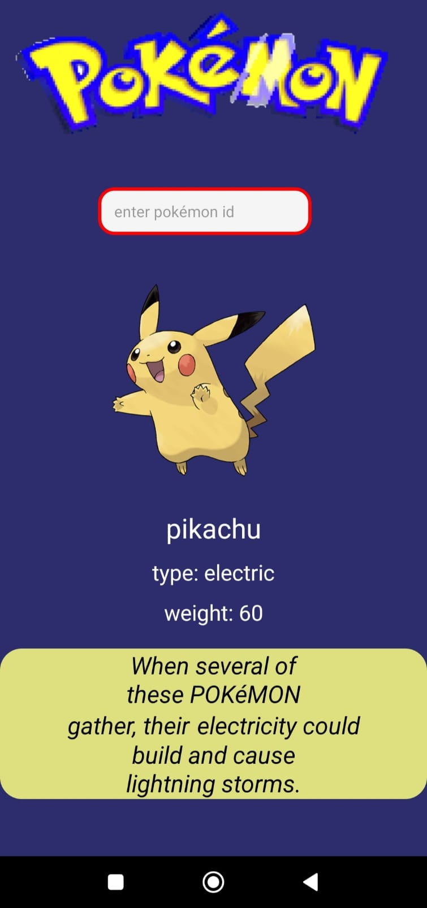

pokedex criada com react native, para utilizar é preciso instalar as dependencias:

expo
axios
core-js
expo-av
expo-font
expo-status-bar
react
react-native
styled-components

a pasta node_mobules e expo já estão inclusas, talvez não seja necessario instalar essas dependencias citadas, mas caso não funcione, apague a pasta expo e a pasta node_modules e instale todas essas dependencias.

para criar o aplicativo, basta ir no site do expo e seguir todas as orientações de criação de aplicativo.

